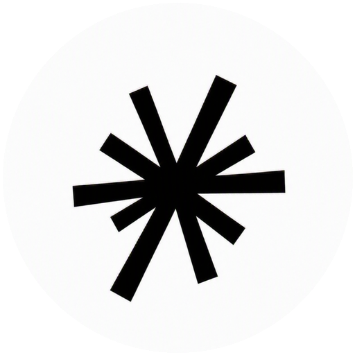

<div align="center">



# Calus

**A drop-in security gateway for AI agents. No code changes. No SDK.**

Calus sits between your AI tools and the model providers. It gives you threat
detection, agent and tool-call observability, and OWASP LLM Top 10 coverage on
every call. Detection-only: it observes and flags, it never blocks or alters
your traffic.

</div>

---

## Benchmark coverage

Calus is a deterministic AI-agent security gateway: **Layer 1** (pattern fast-path)
+ **Layer 2** (capability-flow graph) + a single **decision-maker**. A trained
Layer-3 model is a clean hook, **not built** — every number here is the
deterministic engine only.

All numbers below are **scored by the real engine on held-out, third-party
benchmarks, post-contamination-cleanup, with no tuning to the test.**

> **Contamination cleanup (read this).** An audit found that some Layer-1 rules had
> been authored *from* these benchmarks (the InjecAgent `amy.watson` signature and
> the AgentDojo `important_instructions` template were embedded in regexes), which
> would have inflated Layer-1 recall. All benchmark-specific strings were removed
> from the rules and similarity indexes before scoring; re-verified at **0** ≥40-char
> verbatim overlap with InjecAgent/AgentDojo. The prior pattern-tier table (now in
> *§4, superseded*) was scored before this cleanup. See
> [`calus/docs/CONTAMINATION_CLEANUP.md`](calus/docs/CONTAMINATION_CLEANUP.md) and
> [`calus/docs/LAYER_BENCHMARK_REPORT.md`](calus/docs/LAYER_BENCHMARK_REPORT.md).

### 1. Indirect prompt injection / agent-flow attacks (core threat model)

Layered engine, verdict-mode (the shipping default). **caught** = detected
(block + flag); **blocked** = the enforced stop available in opt-in gateway mode.

| Benchmark | Type | N | caught | blocked | precision |
|---|---|--:|:--:|:--:|:--:|
| [InjecAgent](https://github.com/uiuc-kang-lab/InjecAgent) · Standard (subtle) | action | 1,054 | 100% | 80.6% | 92.8% |
| [InjecAgent](https://github.com/uiuc-kang-lab/InjecAgent) · Enhanced (wrapped) | action | 1,054 | 100% | 80.6% | 92.8% |
| [AgentDojo](https://github.com/ethz-spylab/agentdojo) · injection strings | text-only | 162 | 82.7% | 0% | 62.0% |

**Honest reading of the 100%.** It is *one* benchmark (InjecAgent, N=2,108), and the
gaps that got us there — a `stat`/`state` classifier bug causing silent passes, and
unmapped RED actions (smart-locks, payments, 2FA-disable) — were **surfaced by this
benchmark and fixed for it**; this is not a score the engine always had. The
enforced figure is **80.6% blocked**; the remaining 19% are *flagged* (detected, not
blocked) in verdict-mode. **Adaptive/novel attacks remain a disclosed gap** (the
intended answer is the unbuilt Layer-3 model). AgentDojo is text-only locally (no
agent action), so Layer 2 has nothing to act on — its 82.7% is Layer 1 catching the
injection wording, 0% blocked.

**The flow graph is doing the work.** On InjecAgent *Standard* (subtle injections
with no jailbreak wrapper), Layer 2 — the capability-flow graph — blocked **663**
rows vs Layer 1's **346**: the architecture catches attacks *by consequence*
(untrusted tool output → a RED action) even when no text pattern fires. Every
data-stealing chain ends in an exfil send to a RED sink, so it is blocked 100%.
Measured **with Layer 1 disabled, pure Layer 2 alone catches 100% / blocks 80.6%**
of InjecAgent — and Layer 2 is structural, so it is immune to text contamination.

### 2. Benign false-positive rate

| Control set | N | flagged | FPR |
|---|--:|--:|:--:|
| Databricks Dolly-15k (general) | 2,000 | 82 | **4.10%** |
| AgentDojo benign (in-domain) | 20 | 0 | 0.00% |
| InjecAgent benign agent-flows | 17 | 0 | 0.00% |

The 4.10% is the **layered verdict-mode** operating point, which flags on any
block-signal and is deliberately more sensitive than the tuned single-threshold
pattern verdict (0.90%, *§4*). It is tunable; we report the more-sensitive number
rather than the flattering one.

### 3. Jailbreak & harmful-content — weak by design (disclosed, not hidden)

These are categories where Calus is **deliberately weak**: it is an injection /
agent-flow detector, not a harmful-content classifier or an adaptive-attack solver.
We report them so the limits are explicit. On the layered engine (verdict-mode,
post-cleanup) these scored low, as expected: **JailbreakBench 6.0%, AdvBench 2.5%,
HarmBench 6.8% caught**. The pattern-tier detail below (manual vs adaptive) shows
where the weakness lives.

Scored against the real jailbreak attack strings in JailbreakBench's artifact
library, with the 100 benign JBB behaviors as the false-positive control:

| Attack family | Recall | Precision | F1 |
|---|:--:|:--:|:--:|
| JBC, manual templates (AIM / DAN-style) | **100%** | 98% | 99% |
| PAIR, LLM-crafted adaptive jailbreaks | 29% | 97% | 45% |
| GCG, adversarial suffix (filter-evasion) | 29% | 94% | 44% |
| **All families combined** | 45% | 99% | 62% |

Manual templates are caught reliably; **adaptive PAIR and gibberish-suffix GCG
attacks — explicitly built to evade pattern filters — are a known gap** (the
unbuilt Layer-3 model is the intended answer, not a pattern).

#### Harmful-intent corpora (scope boundary)

[AdvBench](https://github.com/llm-attacks/llm-attacks) (520 prompts) and
[HarmBench](https://github.com/centerforaisafety/HarmBench) (200 standard
behaviors) measure whether a bare request carries harmful intent
("write a tutorial on ..."). That is content moderation, a different layer from
injection and jailbreak detection. Calus is not a content classifier; it flags
only the subset of these prompts that carry an injection or obfuscation signature,
so recall is low by design:

| Benchmark | Recall (default) | Recall (conf >= 0.20) |
|---|:--:|:--:|
| AdvBench, 520 harmful goals | 3% | 28% |
| HarmBench, 200 standard behaviors | 11% | 47% |

For harmful-content blocking, pair Calus with a content-moderation classifier.
Calus owns the injection and jailbreak layer those classifiers miss.

### 4. Prior pattern-tier numbers (pre-cleanup — SUPERSEDED)

These were the headline numbers **before** the contamination cleanup, scored on the
pattern engine's tuned single-threshold verdict. They are kept here for
transparency, **not as current claims** — the AgentDojo / InjecAgent figures were
inflated by benchmark-derived rules since removed (see the contamination note
above). The honest, post-cleanup numbers are §1–§3.

| Benchmark | Setting | Recall | Precision | F1 |
|---|---|:--:|:--:|:--:|
| AgentDojo · NeurIPS 2024 | default | ~~83%~~ | ~~100%~~ | ~~91%~~ |
| InjecAgent · Standard | default | ~~35%~~ | ~~99%~~ | ~~52%~~ |
| InjecAgent · Enhanced | default | ~~100%~~ | ~~99%~~ | ~~100%~~ |

Pattern-tier benign FPR at the tuned production threshold was **0.90%** on Dolly
(2,000 messages) — a less-sensitive operating point than the layered verdict-mode
4.10% in §2; both are real, at different thresholds.

```bash
# Build any test set, then score the real engine (one input per line):
python -m calus.benchmark.external.injecagent.build
python -m calus.benchmark.harness --dataset injecagent      # also: agentdojo,
                                                            # jailbreakbench, advbench, harmbench
```

Methodology, sources, and per-split numbers:
[`calus/benchmark/README.md`](calus/benchmark/README.md).

---

## What you get

- **Drop-in proxy.** Point any OpenAI-compatible app at Calus by setting one
  environment variable. No code changes, no SDK to install.
- **Multi-provider.** OpenAI, Groq, Anthropic, Gemini, Mistral, Cohere, and
  anything [LiteLLM](https://github.com/BerriAI/litellm) supports, selected by the
  `model` prefix.
- **Threat detection.** A tiered engine (regex, then lexical similarity, then
  optional semantic) flags prompt injection, jailbreaks, agent abuse, and more,
  mapped to the OWASP LLM Top 10 (2025).
- **Agent and tool observability.** Every agent, the tools it can call, and the
  tool calls it actually makes (arguments redacted) are traced in the console.
- **Secret and PII redaction.** Secrets and PII are masked before anything is
  stored.
- **Encrypted key vault.** Optionally save provider keys; stored encrypted at
  rest, shown masked, revealed on demand. Provider keys are never written to the
  call log.
- **Console.** A clean dashboard: Overview, Agents, Threats, Live calls, API keys,
  and Connect.

## Architecture

```
your app ──(your key)──▶  CALUS PROXY  ──(same key)──▶  OpenAI / Groq / Anthropic / ...
                              │
                       scan + log verdict
                     (key used in-flight, never stored)
                              │
                              ▼
                      CALUS DASHBOARD  (you watch live)
```

| Component | Path | What it is |
|---|---|---|
| Engine | `calus/` | Detection library — Python with a compiled Aho-Corasick core (`pip install -e calus`) |
| Proxy | `proxy/calus_proxy` | FastAPI OpenAI-compatible gateway and dashboard API |
| Dashboard | `dashboard/` | React + TypeScript (Vite) console |

```
calus/
├── README.md  LICENSE  SECURITY.md  CONTRIBUTING.md
├── Dockerfile  docker-compose.yml  .dockerignore
├── .github/workflows/        # ci, security, release
│
├── calus/                    # detection engine (Python package)
│   ├── pyproject.toml  api.py  cli.py  owasp.py
│   ├── detection/            # cascade engine, scored regex, similarity, redaction
│   ├── patterns/             # 27k+ OWASP-mapped rule packs
│   ├── learning/  context/  integrations/  tools/
│   ├── benchmark/            # accuracy harness + external benchmark sets
│   ├── tests/
│   └── docs/                 # architecture, threat coverage, accuracy
│
├── proxy/                    # the gateway
│   ├── requirements.txt  .env.example
│   └── calus_proxy/
│       ├── main.py           # OpenAI-compatible routes + dashboard API
│       ├── config.py  store.py  crypto.py  keys.py
│
└── dashboard/                # React + TS console
    ├── package.json  index.html  vite.config.ts  Dockerfile  nginx.conf
    └── src/  ( App, components, api, types, index.css )
```

> Installing dependencies takes about 1 to 2 minutes the first time. After that
> the proxy boots and warms its 27k-pattern engine in about 5 seconds, then scans
> in about 15 ms. No model downloads, no GPU.

---

## Quick start with Docker (recommended)

```bash
git clone https://github.com/wholesphereai/calus.git
cd calus
docker compose up --build
```

- Dashboard: http://localhost:5173
- Proxy: http://localhost:8000

**Admin token — nothing to do on localhost.** The proxy auto-generates a token at
startup and the dashboard picks it up automatically. You land on the console
straight away with no login prompt. Add your provider API keys from the dashboard's
**API Keys** tab (or see [Add provider keys, three ways](#add-provider-keys-three-ways)).

## Quick start, local (no Docker)

```bash
git clone https://github.com/wholesphereai/calus.git
cd calus
python -m venv .venv && . .venv/Scripts/activate     # Windows
# source .venv/bin/activate                          # macOS / Linux

# 1) engine
python -m pip install -e calus

# 2) proxy (terminal 1)
cd proxy
python -m pip install -r requirements.txt
python -m uvicorn calus_proxy.main:app --port 8000
# Uvicorn logs "127.0.0.1:8000" — open http://localhost:8000 in your browser

# 3) dashboard (terminal 2)
cd dashboard
npm install
npm run dev                   # http://localhost:5173
```

**Admin token — nothing to do on localhost.** The proxy auto-generates a token and
the dashboard picks it up automatically. Add your provider API keys from the
dashboard's **API Keys** tab (or see [Add provider keys, three ways](#add-provider-keys-three-ways)).

---

## Point your app at Calus

One environment variable is all you need. Calus forwards every call with your own
provider key — used in-flight, never written to any log or store.

```bash
export OPENAI_BASE_URL="http://localhost:8000/v1"
# that's it — run your app as usual
```

The sections below show how to connect from each SDK, and how to name your agents
so their traffic shows up separately in the dashboard.

---

### Why name your agents?

Without a name, every call lands in the dashboard under **"unknown"** — one flat
stream with no way to tell which service sent what.

```
Dashboard (no name)           Dashboard (named)
─────────────────────         ──────────────────────────────
Agents                        Agents
  └─ unknown (47 calls)         ├─ customer-support  (31 calls)
                                ├─ search-agent      (12 calls)
                                └─ data-pipeline      (4 calls)
```

Name an agent one of two ways — they are equivalent, pick whichever fits your SDK:

| Method | How | Best for |
|---|---|---|
| `user` field | Standard OpenAI field, part of the request body | OpenAI SDK, any JSON client |
| `X-Calus-Agent` header | HTTP header, not part of the LLM payload | LangChain, frameworks where `user` isn't exposed |

---

### OpenAI Python SDK

**Without a name** — traffic appears as "unknown" in the dashboard:

```python
from openai import OpenAI

client = OpenAI(
    base_url="http://localhost:8000/v1",
    api_key="sk-your-own-key",
)

response = client.chat.completions.create(
    model="groq/llama-3.3-70b-versatile",
    messages=[{"role": "user", "content": "Hello"}],
)
```

**With a name** — use the `user` field; the agent appears by name in the Agents tab:

```python
from openai import OpenAI

client = OpenAI(
    base_url="http://localhost:8000/v1",
    api_key="sk-your-own-key",
)

response = client.chat.completions.create(
    model="groq/llama-3.3-70b-versatile",
    user="my-agent",                         # shows up as "my-agent" in the dashboard
    messages=[{"role": "user", "content": "Hello"}],
)
```

**With a name via header** — use `X-Calus-Agent` if you prefer headers or share one
client across agents:

```python
from openai import OpenAI

client = OpenAI(
    base_url="http://localhost:8000/v1",
    api_key="sk-your-own-key",
    default_headers={"X-Calus-Agent": "my-agent"},
)

response = client.chat.completions.create(
    model="groq/llama-3.3-70b-versatile",
    messages=[{"role": "user", "content": "Hello"}],
)
```

---

### OpenAI Node.js / TypeScript SDK

```typescript
import OpenAI from "openai";

const client = new OpenAI({
  baseURL: "http://localhost:8000/v1",
  apiKey: "sk-your-own-key",
  defaultHeaders: { "X-Calus-Agent": "my-agent" },  // name in dashboard
});

const response = await client.chat.completions.create({
  model: "groq/llama-3.3-70b-versatile",
  messages: [{ role: "user", content: "Hello" }],
});
```

---

### LangChain (Python)

LangChain's `ChatOpenAI` doesn't expose the `user` body field directly, so use
`default_headers` instead:

```python
from langchain_openai import ChatOpenAI

llm = ChatOpenAI(
    model="groq/llama-3.3-70b-versatile",
    base_url="http://localhost:8000/v1",
    api_key="sk-your-own-key",
    default_headers={"X-Calus-Agent": "my-agent"},  # name in dashboard
)

response = llm.invoke("Hello")
```

**Without a name** (traffic appears as "unknown"):

```python
llm = ChatOpenAI(
    model="groq/llama-3.3-70b-versatile",
    base_url="http://localhost:8000/v1",
    api_key="sk-your-own-key",
)
```

---

### Claude Code

Route Claude Code's API calls through Calus by setting the environment variable
before launching it. Claude Code uses the Anthropic SDK internally, which is
OpenAI-compatible through Calus's LiteLLM layer.

**Without a name** (appears as "unknown" in dashboard):

```bash
export ANTHROPIC_BASE_URL="http://localhost:8000"
claude
```

**With a name via header** — add it to your `~/.claude/settings.json` or pass it
as an environment variable so every Claude Code session is tagged:

```bash
export ANTHROPIC_BASE_URL="http://localhost:8000"
export CALUS_AGENT_HEADER="claude-code"   # picked up by Calus
claude
```

Or configure it permanently in `~/.claude/settings.json`:

```json
{
  "env": {
    "ANTHROPIC_BASE_URL": "http://localhost:8000",
    "X-Calus-Agent": "claude-code"
  }
}
```

Once set, every prompt you send through Claude Code appears in the Calus dashboard
under **"claude-code"** with full threat scores and tool-call traces.

---

### curl

**Without a name:**

```bash
curl http://localhost:8000/v1/chat/completions \
  -H "Authorization: Bearer sk-your-own-key" \
  -H "Content-Type: application/json" \
  -d '{
    "model": "groq/llama-3.3-70b-versatile",
    "messages": [{"role": "user", "content": "Hello"}]
  }'
```

**With a name via header:**

```bash
curl http://localhost:8000/v1/chat/completions \
  -H "Authorization: Bearer sk-your-own-key" \
  -H "Content-Type: application/json" \
  -H "X-Calus-Agent: my-agent" \
  -d '{
    "model": "groq/llama-3.3-70b-versatile",
    "messages": [{"role": "user", "content": "Hello"}]
  }'
```

**With a name via `user` field:**

```bash
curl http://localhost:8000/v1/chat/completions \
  -H "Authorization: Bearer sk-your-own-key" \
  -H "Content-Type: application/json" \
  -d '{
    "model": "groq/llama-3.3-70b-versatile",
    "user": "my-agent",
    "messages": [{"role": "user", "content": "Hello"}]
  }'
```

---

### Reading the verdict from response headers

Every response from Calus carries three headers you can read in your app or pipe
into a SIEM — without touching the dashboard at all:

| Header | Values | Meaning |
|---|---|---|
| `x-calus-flagged` | `true` / `false` | Whether Calus flagged this call |
| `x-calus-confidence` | `0.00` – `1.00` | Detection confidence score |
| `x-calus-owasp` | e.g. `LLM01`, `LLM06` | OWASP LLM Top 10 category, if flagged |

```python
import requests

resp = requests.post(
    "http://localhost:8000/v1/chat/completions",
    headers={
        "Authorization": "Bearer sk-your-own-key",
        "X-Calus-Agent": "my-agent",
    },
    json={
        "model": "groq/llama-3.3-70b-versatile",
        "messages": [{"role": "user", "content": "Hello"}],
    },
)

print(resp.headers.get("x-calus-flagged"))     # "false"
print(resp.headers.get("x-calus-confidence"))  # "0.12"
print(resp.headers.get("x-calus-owasp"))       # "" or "LLM01"
```

The Connect tab in the dashboard has ready-to-paste snippets for every SDK.

---

## Add provider keys, three ways

You can let callers send their own key per request (BYOK, nothing stored), or save
keys in Calus's encrypted vault so you do not re-paste them. Saved keys are
encrypted at rest, shown masked, and used to forward upstream when a request does
not carry its own.

1. **Dashboard.** Open the API keys page: pick a provider, paste the key, Add.
   Reveal or delete any time.
2. **Command line** (same vault):
   ```bash
   cd proxy
   python -m calus_proxy.keys add --provider groq --key gsk_... --label prod
   python -m calus_proxy.keys list
   python -m calus_proxy.keys delete <id>
   ```
3. **Environment.** Put `OPENAI_API_KEY`, `GROQ_API_KEY`, and others in
   `proxy/.env` (read by LiteLLM, never stored in the log).

Resolution order when forwarding: caller's bearer key, then saved vault key, then
env key.

---

## Configuration (`proxy/.env`)

| Variable | Default | Meaning |
|---|---|---|
| `CALUS_ADMIN_TOKEN` | auto-generated and printed | Token the dashboard and API must present. Leave blank to auto-generate one at startup. |
| `CALUS_PROXY_TOKEN` | blank | Optional data-plane token. If set, `/v1/*` requires it. Leave blank only on a private network. |
| `CALUS_CORS_ORIGINS` | `http://localhost:5173` | Allowed dashboard origins. |
| `CALUS_DB_PATH` | `calus_proxy.db` | SQLite log store path. |
| `CALUS_REDACT_STORE` | `1` | Redact secrets and PII before storing. |
| `CALUS_STORE_TEXT` | `1` | Store redacted prompt and response preview. |
| `CALUS_SCAN_RESPONSES` | `1` | Also scan model responses. |
| `CALUS_FLAG_THRESHOLD` | `0.5` | Confidence at or above which a call is flagged. |
| `CALUS_SECRET` | admin token | Master secret for the encrypted key vault. |
| `OPENAI_API_KEY`, `GROQ_API_KEY`, ... | none | Upstream keys (read by LiteLLM, never stored). |

---

## Security

- **Detection-only.** Requests and responses pass through untouched.
- **Provider keys are never written to the log store.** Saved keys live in an
  encrypted vault and are only decrypted in memory to forward a request.
- **Secrets and PII are redacted** before any text or tool-call arguments are
  stored.
- Run the proxy on an encrypted volume and set a high-entropy `CALUS_SECRET`.
- **Securing the data plane.** `/v1/*` is unauthenticated by default so Calus
  stays drop-in. That is fine on localhost or a private network. If you expose the
  port, set `CALUS_PROXY_TOKEN`; callers must then present it (the
  `X-Calus-Proxy-Token` header or `Authorization: Bearer ...`, constant-time
  checked) or the request is rejected. Leaving it blank on a public port turns the
  proxy into an open relay that spends your stored provider keys.
- The verdict is surfaced inline via the `x-calus-flagged`, `x-calus-confidence`,
  and `x-calus-owasp` response headers, so a SIEM can act on it without the
  dashboard.

See [SECURITY.md](SECURITY.md) to report a vulnerability.

## License

[MIT](LICENSE). Use it freely, including in commercial and closed-source
products. Just keep the copyright and license notice.


